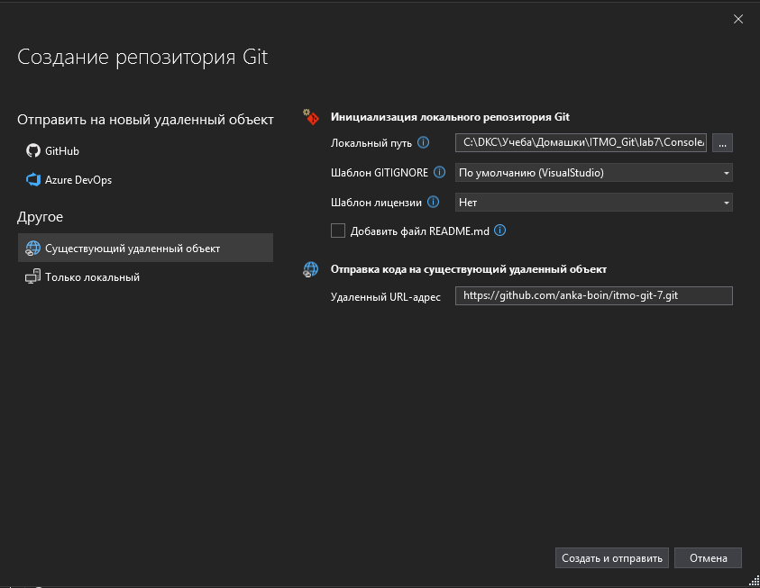
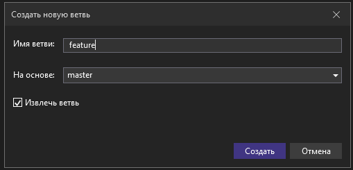
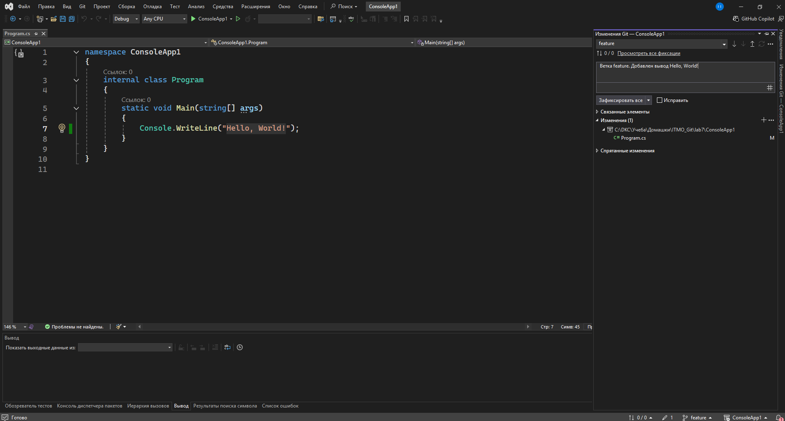
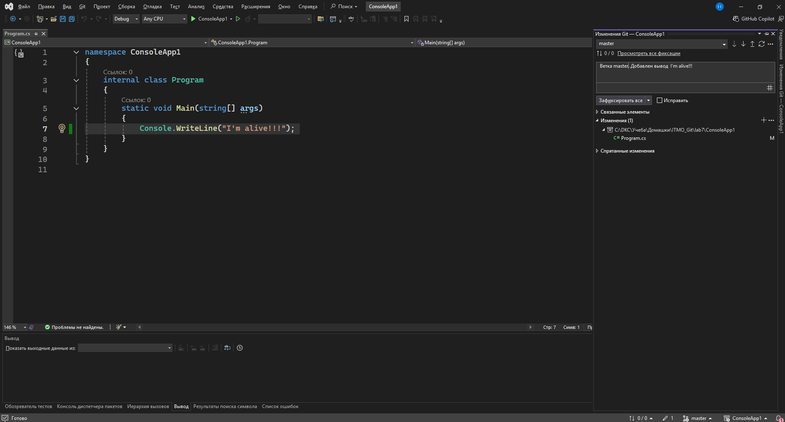
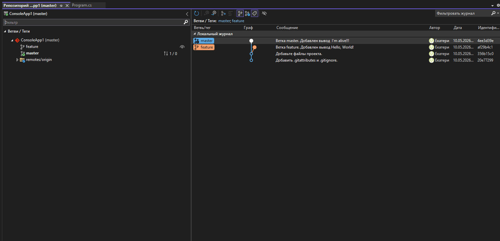
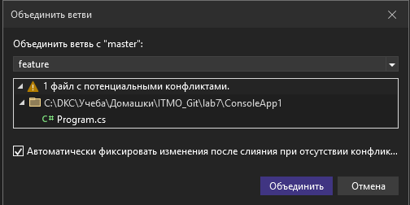
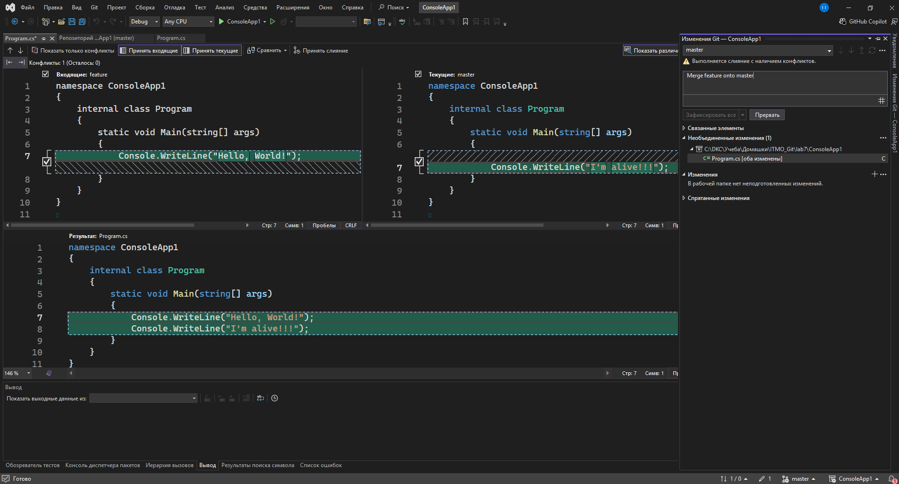
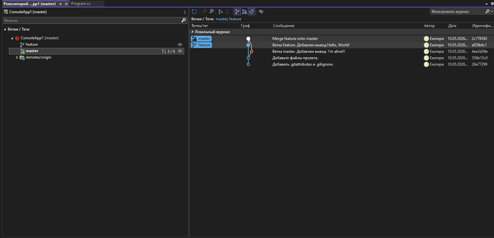

# Система контроля версий Git

## Самостоятельная работа 5. Переписывание истории

### Задание

1. Продемонстрируйте решение конфликта слияния (двух локальных ветвей, или локальной и удаленной ветвей) посредством VisualStudio или PyCharm (на выбор).

### Отчет

**1. Продемонстрируйте решение конфликта слияния посредством VisualStudio.**

Подключение репозитория

Создание новой ветки feature

Внесение изменений в ветку feature

Внесение изменений в ветку master

Состояние репозитория перед слиянием веток

Слияние 

Результат

